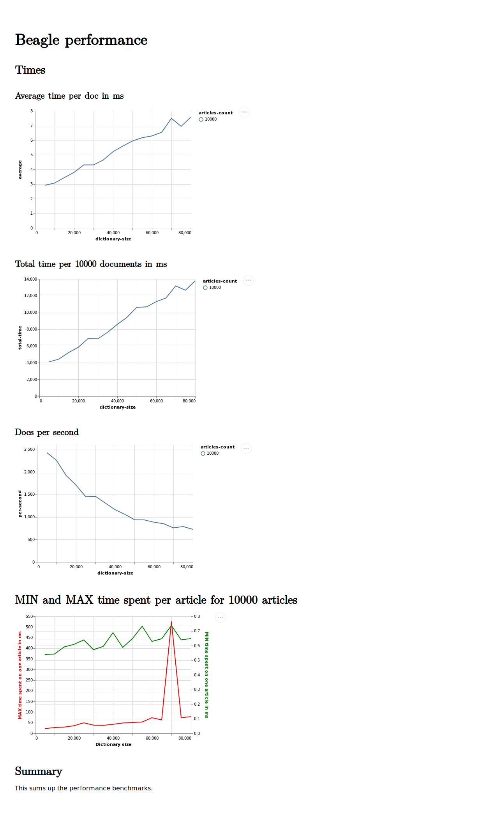

<a href="http://www.tokenmill.lt">
      
</a>

# beagle-performance-benchmarks

Performance benchmarks for Beagle library and a comparison with other stored query solutions.

## Available Benchmarks for Phrase Matching

3 are available:
- `make run-beagle-bench`: in docker-compose runs Beagle benchmark
- `make run-es-bench`: in docker compose runs Elasticsearch Percolator benchmark
- `run-fake-percolator-bench`: in docker-compose runs Beagle benchmark when beagle is deployed as an HTTP server
that simulates Elasticsearch Percolator API. 

## Phrases Benchmarking

Given a list of phrases highlight those phrases in the given list of documents.

```bash
clj -m bench.phrases
```

To see the available options run

```bash
clojure -m bench.phrases -h
```

It outputs something like this:
```
  -d, --dictionary-file DICTIONARY     resources/top-10000.csv  Path to the dictionary file
  -o, --output OUTPUT                  vals-1569915647794.json  Path to the output file
  -t, --texts-file TEXTS_CSV_FILE                               Path to the CSV file with texts
  -s, --dictionary-step STEP           5000                     Step size for increase in dictionary
  -p, --parallel PARALLEL              true                     Should the benchmark be run in parallel
  -c, --concurrency CONCURRENCY        16                       Number of concurrent executions.
  -k, --key KEY                        :content                 CSV header key to select
  -i, --implementation IMPLEMENTATION  :beagle                  Highlighter implementation
  -w, --warm-up WARM-UP                true                     Should the warm-up be run
      --es-host ES_HOST                http://127.0.0.1:9200    Elasticsearch hostname
      --slop SLOP                      0                        Phrase slop for dictionary entries
      --case-sensitive CASE_SENSITIVE  true                     Should matching be case sensitive
      --ascii-fold ASCII_FOLD          false                    Should matching be ascii folded
      --stem STEM                      false                    Should matching be stemmed
      --stemmer STEMMER                :english                 which stemmer should be used
  -h, --help

```

The results of the benchmark are written to a file specified with an `-o` option. By default, output is written to
the current dir in a file `(str "vals-" (System/currentTimeMillis) ".json")`.

## Preview benchmark results

```bash
clojure -m bench.view BENCHMARK_OUTPUT_FILE 
```

## Download news dataset from

We run the benchmark on a news dataset downloaded from [Kaggle](https://www.kaggle.com/snapcrack/all-the-news/downloads/all-the-news.zip/4).

## Phrase Percolation Benchmarks

### Sequential Beagle

Beagle highlights phrases in a text document in as low as 1.3 ms with dictionary size of 5000 phrases.


Max time spent (see red line) in highlighting text grows approximately linearly with the size of dictionary. 

Minimum time spent in in highlighting text is as low as 0.4 ms irregardless of the dictionary size.


### Beagle Concurrent

Beagle with concurrency=16 



### Elasticsearch Percolator

Elasticsearch Percolator with concurrency=16 


### Beagle Faking the Elasticsearch Percolator 

Beagle implementing the API of Elasticsearch Percolator with concurrency=16


During the benchmarks Elasticsearch Percolator was ~2x slower than Beagle deployed in an HTTP server 
with the nearly identical API. 

## License

Copyright &copy; 2019 [TokenMill UAB](http://www.tokenmill.lt).

Distributed under the The Apache License, Version 2.0.
